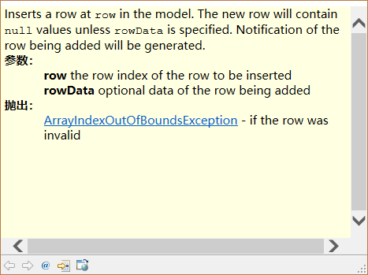
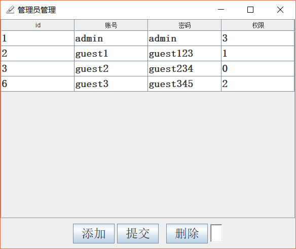
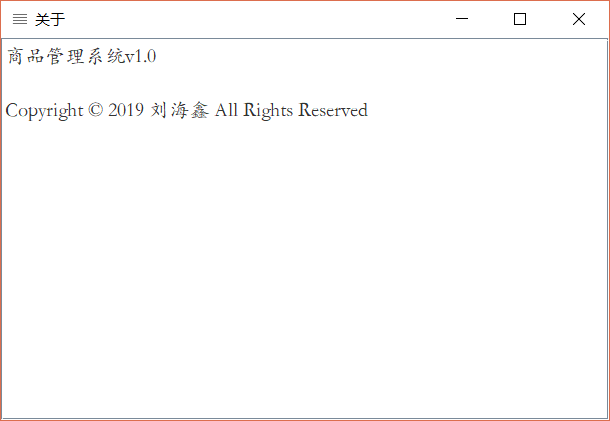

# 商品管理系统

《基于开源项目开发》的作业。今天整理电脑翻出来了。


---

> 以下是当时交的报告。

**[流程图](doc/diagram/view.html)**

【项目背景】当前商店超市都趋向于用电脑处理交易数据，然而对于中小型的超市，现今并没有很合适的商品管理系统。本系统就是一款专为中小型超市商店设计的管理系统，提供基本的商品入库出售功能。
【系统需求】商品管理系统是为中小型超市、商店准备的一款商品出售管理系统，使商品管理过程更加简单。具体实现基本的商品入库出售，还要求一定的管理员机制。

## 功能模块
### （用户登录）
用户登录模块是用于验证用户登录及获取用户权限的模块。对于商品管理系统，一个店员拥有的权限明显和店长不应该一样。用户登录就是主要为了区分不同权限个体。

### 商品种类管理

商品种类管理是进行商品管理的第一步，只有将商品信息录入到系统中才能进行商品管理。通过商品种类管理实现商品种类的增删查改。

### 商品入库

商品入库是指商店在进货后将商品添加到数据库的操作。考虑实际情况，肯定不能用键盘一个一个敲。在这里，我采用的方案是通过条码扫描得到商品编号，然后自动增加。

### 商品出售

商品出售是在商店实际进行商品销售时使用的模块。通过扫码列出客户选购的商品，并实现实时计算客户选购的商品的价格，结算并在库存中减掉商品。

### 管理员管理

增删管理员，修改管理员的密码、权限等。不同管理员有不同的权限等级，权限等级足够的管理员可以修改管理员组的信息。若忘记所有高权限管理员的密码，你将不得不在数据库里修改管理员密码。

### 系统设置

在进行项目部署时，显然不可能每改变一次环境就重新改代码编译，因而，通过配置存储一些关键信息是必须的。
“系统设置”窗口中可以进行一些系统的设置，主要是数据库的登录信息等。在系统第一次打开时，由于没有配置数据库的登录信息，数据库连接会出错，此时系统设置窗口会自动弹出。

### 生成报告

虽然系统提供了比较完整的商品的入库出售体系，但有时管理员希望掌握库存的详细情况，来调整下一步的市场策略，此时就会用到生成报告功能。生成报告功能将会用一个网页以表格的形式将库存商品的信息加以展示，可以直接将数据复制或者打印等。

### 关于

虽然本系统几乎没有被盗用的价值，但为了看上去像一个标准的、正规的软件我还是加入了这一界面。（没错，皮这一下我很开心~~）

### 详细设计

为了说明本系统是如何工作的，这里选择比较有代表性的商品种类管理来进行详细说明。

【输入】用户点击不同按钮、用户修改的表格数据、用户输入的每页内容条数和id。

【输出】处理后的当前分页的商品信息。

【处理过程】
本模块窗口打开时默认加载前20条数据，这是从数据库读取数据并插入到表格。

对于添加和修改功能，系统提供的方案是利用表格控件本身的编辑功能实现编辑，在点击按钮后统一将数据变更反馈到数据库。由于添加和修改执行不同的`sql`指令，所以需要区分数据是否为新增的数据。目前我的方案是新增数据将`id`直接设置成`add`，之后判断表中的这一字段。对每一行循环，有空数据的略过，执行拼接好的`sql`语句。在此之后，为了更新表中数据，我将当前窗口直接重新打开了一次，这样可以高效率运用之前的代码。为了保证新窗口的位置、页面、状态等信息与原窗口一致，我将原窗口的对象传给了新窗口，具体见技术总结部分。
删除功能比较简单，就是拼接一条`delete`命令。

分页功能的实现。分页功能是涉及大量数据时必不可少的，这里我直接运用`sql`的`limit`功能实现的分页。我在`gui`中放置了两个`spinner`来设置每页显示的记录条数和当前的页码。至于判断设置的数值是否有效见技术总结部分。

为了详细介绍本部分功能，我借助`plantuml`绘制了流程图，但流程图较大，无法直接插入文档，将随压缩包提交，详细见附录部分。

【布局】
为了保证界面整体整洁并且可以在缩放的过程中保证按钮等相对位置不变，本系统广泛应用了多种布局嵌套的方式。虽然绝对坐标比较简单省事，但本系统用嵌套的方式实现了更好的效果。例如：商品种类管理是以`Border Layout`为主布局，通过放置`panel`在其中使用了流式布局和表格布局来确定控件的相对位置。其他大概也如此。（图：商品种类管理中的控件布局的嵌套方式和界面设计）


## 技术总结

### 一、maven的使用

`Maven`项目对象模型(POM)，可以通过一小段描述信息来管理项目的构建，报告和文档的软件项目管理工具。（搜狗百科）

本项目中，`maven`的使用倒是没有起到太大的作用，但的确节省了配置环境的工作。

通过`maven`导入数据库驱动`mysql-connector-java`

```xml
		<!--mysql驱动包 -->
​		<dependency>
​			<groupId>mysql</groupId>
​			<artifactId>mysql-connector-java</artifactId>
​			<version>5.1.35</version>
​		</dependency>
```

通过maven导入`json`库`jackson-databind`

```xml
<dependency>
	<groupId>com.fasterxml.jackson.core</groupId>
	<artifactId>jackson-databind</artifactId>
	<version>2.3.1</version>
</dependency>
```

通过`maven install`实现项目打包成`jar`包。

```xml
<build>  
    <plugins>  
        <plugin>  
            <groupId>org.apache.maven.plugins</groupId>  
            <artifactId>maven-jar-plugin</artifactId>  
            <configuration>  
                <archive>  
                    <manifest>  
                        <!--添加classpath -->  
                        <addClasspath>true</addClasspath>  
                        <!--添加依赖包名称 -->  
                        <classpathPrefix>lib/</classpathPrefix>  
                        <!--main方法对应的类 -->          
                        <mainClass>homework.basedonopensource.App</mainClass>  
                    </manifest>  
                </archive>  
            </configuration>  
        </plugin>  
        <!--拷贝第三方依赖包到lib目录 -->  
        <plugin>  
            <groupId>org.apache.maven.plugins</groupId>  
            <artifactId>maven-dependency-plugin</artifactId>  
            <executions>  
                <execution>  
                    <id>copy</id>  
                    <phase>package</phase>  
                    <goals>  
                        <goal>copy-dependencies</goal>  
                    </goals>  
                    <configuration>  
                    <outputDirectory>${project.build.directory}/lib</outputDirectory>  
                    </configuration>  
                </execution>  
            </executions>  
        </plugin>  
    </plugins>  
</build>  
```


### 二、无标题窗口的实现

#### 实现窗口无标题栏

实现无标题可以有两种方式，首先直接设置`JFrame`的`this.setUndecorated(true);`
或者，不再使用`JFrame`，而用`JWindow`代替，`JWindow`本来就没有标题。
由于对`JWindow`不熟悉以及其他种种原因，我选择了第一种方案。

#### 使无标题的窗口能被拖动

无标题拖动在应用程序设计中是一个常见问题，其他语言（`VB`，`C#`等）主流方案是拦截Windows消息来实现，效果比较好，看上去就跟有标题的一样。但这样做对于`Java`来说成本太高，毕竟如果用到`Win32api`将导致系统受到`Windows`这个框架限制。

最终我的解决方案是在按下鼠标按键使记录鼠标坐标，然后实时计算坐标移动窗口。虽然这样效率稍低，但也能接受。

#### 解决无标题窗口在任务栏不显示导致无法操作的问题

我使用的无标题方案在实际测试中发现了一个问题，就是无标题的窗口同时不再显示任务栏图标了，这直接导致窗口被盖住后无法操作。

这个问题最终我用变通的方法解决了，即创建另一个窗口用于显示图标。

为了让窗口显示到最前，我使用了“置顶——取消置顶”的方案。

【具体】


附：无标题窗口显示边框
```java
this.rootPane.setBorder(new LineBorder(Color.gray, 4));
```
为了界面美化，我最初计划是设计一个异型窗口，如椭圆形，甚至用遮罩层实现镂空窗口，但我最终发现这些东西在java中实现时比较困难，对平台的依赖性太高，舍本逐末，于是放弃了。

### 三、背景图片的加载
背景图片加载在我看来应该是`GUI`一个重要组成部分，但坑爹的`swing`竟然没有给`JFrame`提供直接设置`JFrame`的背景图的方法。
通过标签间接添加图片
该方法来自[https://blog.csdn.net/cannel_2020/article/details/7063366](https://blog.csdn.net/cannel_2020/article/details/7063366)，间接实现了插入图片的功能。

```java
		//背景图片的路径。（相对路径或者绝对路径。本例图片放于"java项目名"的文件下）
		String path = "background.jpg";
		// 背景图片
		ImageIcon background = new ImageIcon(path);
		// 把背景图片显示在一个标签里面
		JLabel label = new JLabel(background);
		// 把标签的大小位置设置为图片刚好填充整个面板
		label.setBounds(0, 0, this.getWidth(), this.getHeight());
		// 把内容窗格转化为JPanel，否则不能用方法setOpaque()来使内容窗格透明
		JPanel imagePanel = (JPanel) this.getContentPane();
		imagePanel.setOpaque(false);
		// 把背景图片添加到分层窗格的最底层作为背景
		this.getLayeredPane().add(label, new Integer(Integer.MIN_VALUE));
```


#### 通过相对路径减少对环境的依赖

把路径写在代码中显然将对部署时增加压力，为了减少对环境的依赖，需要用到相对路径。

相对路径就是指由这个文件所在的路径引起的跟其它文件（或文件夹）的路径关系。具体有关相对路径知识请参加[https://baike.sogou.com/v67630690.htm?fromTitle=相对路径](https://baike.sogou.com/v67630690.htm?fromTitle=相对路径)，这里不再详细介绍。

#### 将图片添加到项目资源中直接跟随打包

使用相对路径虽然一定程度减少了麻烦，但实际上部署还是多了额外的配置。为了进一步进行规范化，我试图将图片放入`classpath`，然后在代码中调用。

然而这样得到的地址打成jar包后变成了`…….jar:\……\****.png`的格式，无法被识别。于是我不得不写了以下代码来获取图片。由于通过`byte`数组中转，解决了路径的问题。

```java
InputStream btBack = this.getClass().getClassLoader().getResourceAsStream("back.png");
		ByteArrayOutputStream baos = new ByteArrayOutputStream();
		int b = 0;
		try {
			while ((b = btBack.read()) != -1) {
				baos.write(b);
			}
		} catch (IOException e1) {
			// TODO 自动生成的 catch 块
			e1.printStackTrace();
		}
		// 背景图片
		ImageIcon background = new ImageIcon(baos.toByteArray());
```

### 四、HTML 相关知识

生成报告部分我通过拼接字符串生成了一个网页，并调用系统浏览器打开，这就涉及了一些HTML知识。
HTML表格
【HTML表格的语法基本格式】

```html
<table>
<tr>
<th>列1</th>
<th>列2</th>
</tr>
<tr>
<td>数据1</td>
<td>数据2</td>
</tr>
……
</table>
```

通过`jQuery`获取`json`数据，并更新页面元素

```js
$.get("https://v1.hitokoto.cn/",function(data,status){ 
	$("#div1").text(data.hitokoto+'——'+data.from); 
}); 
```

### 五、表格控件数据的显示

显示查询结果，显然只有表格能承载这一任务，然而`java`中表格控件实在做的不是很直观。

#### 表格的模型

`Java`中表格创建通过绑定`defaultModel`来加载数据

```java
table = new JTable(defaultModel);
```

`defaultModel`可以增删数据行，“行”在这里通常指一个`Vectory`对象。



#### 在查询的循环中添加表格数据

```java
					while (rs.next()) {
						if(exLoop) {
							while (defaultModel.getRowCount() > 0) {
								defaultModel.removeRow(0);
							}
							exLoop=false;
						}
						Vector rowData = new Vector();
						rowData.add(rs.getInt("id"));
						rowData.add(rs.getString("go_name"));
						rowData.add(rs.getString("go_num"));
						rowData.add(rs.getDouble("go_price"));
						defaultModel.insertRow(defaultModel.getRowCount(), rowData);
					}
```

#### 通过defaultModel操作表格数据
（略）

### 六、查询结果分页的实现

```java
//【变量的声明部分】	
private int pageNum = 1;
	private Object prePageValue=1;
	private Object prePageCountValue=10;
```

【介绍】利用里面`limit` 功能进行分页的

【分页功能的输入】当前页码，每页包含的记录条数

【分页功能的输出】针对当前页码的记录

【举例说明】

`Select * from test where score<60 limit 3,20`表示查询第四页的内容，每页显示20条记录。

【额外的判断】输入的页码数和每页记录条数是否符合要求

- 记录条数是要求大于1小于100

- 当前页码数则没有直接进行判断，而是试图用用户输入的数据进行一次查询，如果没查到结果，证明输入值无效，页码数回退到之前的输入状态。

### 七、重载后保留窗口数据
#### 重新加载窗口以还原输入控件状态

对于有表格的窗口来说，将表格以及其他所有有输入功能的控件内容删除再重新添加，成本无疑是高昂的，而且还会提高出现莫名其妙BUG的可能性。为了重置窗口状态，我new了一个新窗口并dispose当前窗口。

#### 传值保证新窗口的位置状态等信息与原来保持一致。

思路很明确，但这里我掌握了一个技巧，即直接将原对象的引用传过来，这样使代码简洁，可读性提高不少。

```java
	public frmGoodKind(frmGoodKind pre) {
		this();
		this.setBounds(pre.getBounds());
		this.setFocusableWindowState(pre.getFocusableWindowState());
		this.prePageCountValue=pre.prePageCountValue;
		this.prePageValue=pre.prePageValue;
		this.spinner.setValue(prePageValue);
		this.spinner_1.setValue(prePageCountValue);
		
	}
```

### 八、对于条形码扫描装置的认识及针对设计

条形码扫描装置在扫描条形码后电脑当前活动窗口会接收到一串数字和键盘回车。本系统中有两处通过检测这个回车信号来进行操作。

### 九、List对象的相关认识和操作

#### 模型、操作

`List`对象与`table`对象在这部分比较相似，具体省略，可以翻看之前对`table`的介绍。
通过`e.getClickCount()==2`判断鼠标双击并执行删除行操作

### 十、权限等级系统的设计

在用户登录后，不同用户将拥有不同权限，如果权限达不到要求，模块会自动退出。

### 十一、通过json存储用户数据

#### Json的数据格式

`Json`是一种用字符串存取配置信息的数据格式，信息以键值对的形式在其中存储：

```json
{"password":"Liu1998/0604","driver":"com.mysql.cj.jdbc.Driver","exists":1,"user":"root","dburl":"jdbc:mysql://localhost:3306/commodity?useSSL=false&serverTimezone=GMT"}
```

#### json的序列化反序列化

序列化指将对象转换成`json`字符串的形式，反序列化顾名思义自然是将`json`字符串转换成对象的操作。

如上面的`json`字符串对应的关系

用`HashMap`承接并直接用`get`等方法获取配置。


### 十二、数据库的使用

> 数据库是用于存储和管理数据的数据处理系统，其核心功能即“增删查改”。

#### Insert

`Mysql`用`insert`命令来实现插入数据的操作。
```sql
INSERT INTO tbl_name VALUES(expr, expr)
```

然而在我实际操作时却遇到了一个问题：在插入数据时不指定自增的`id`和拥有默认值的字段，结果发现插入失败了。找了好久才找到资料，即需要指定字段名

```sql
INSERT INTO tbl_name(fieldName, fieldName) VALUES(expr, expr)
```

#### Delete

`Mysql`用`insert`命令来实现删除记录的操作。

```sql
DELETE FROM tbl_name WHERE exper
```

`Delete`语句相当危险，若忘记写`where`语句或者出现逻辑错误导致`where`语句后的表达式恒成立会导致整个表的记录都被删除。

#### Select

`Mysql`用`insert`命令来实现查询操作。

```sql
SELECT select_expr FROM table_references WHERE exper
```

#### Update

```sql
UPDATE table_reference SET col_name1=expr1 WHERE where_condition
```

#### 其他问题

遇到无法连接数据库的问题，根据错误信息判断需要修改密码，然而由于`mysql`版本问题老的修改密码语句无效，后找到新的命令

```sql
ALTER USER 'root'@'%' IDENTIFIED WITH mysql_native_password BY 'Liu1998/0604';
```

拼接字符串时发现教程提供的用`+`无法实现，原因是不同数据库这一操作符不同，`mysql`只支持用`concat`函数。

## 运行界面





